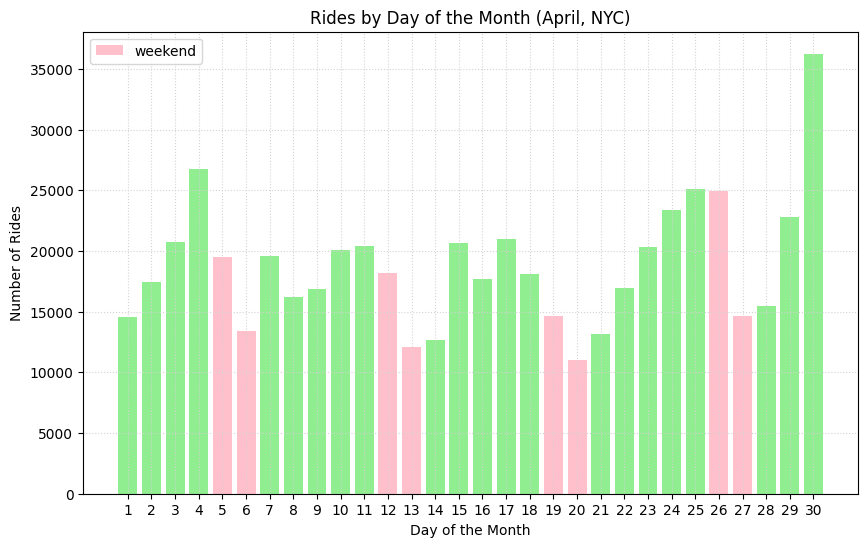
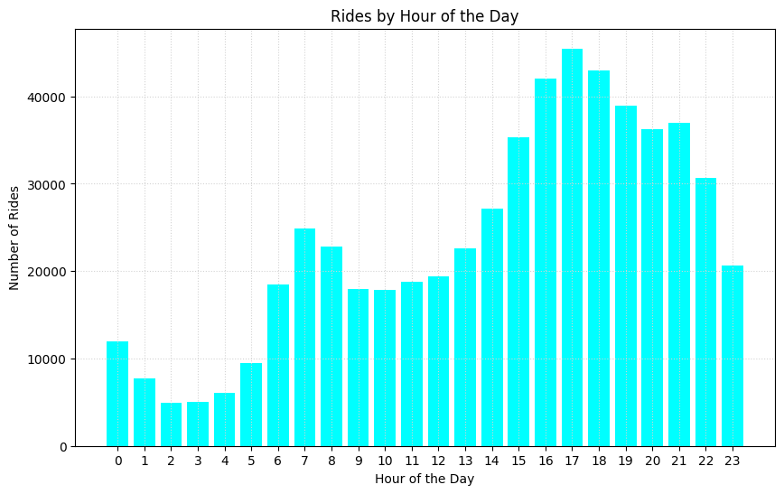
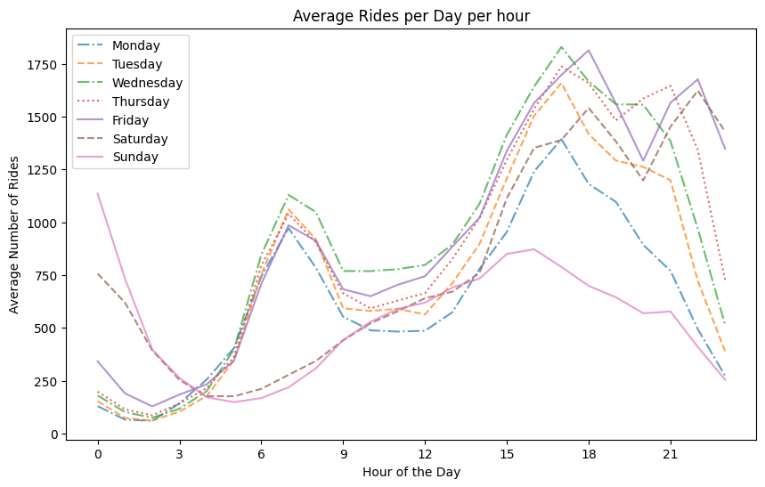
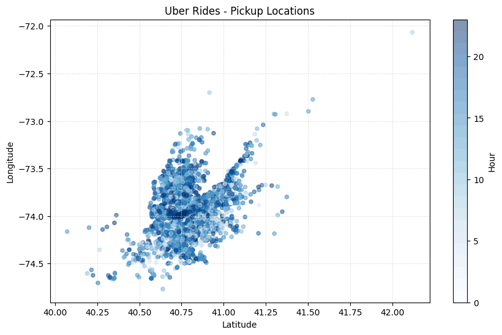
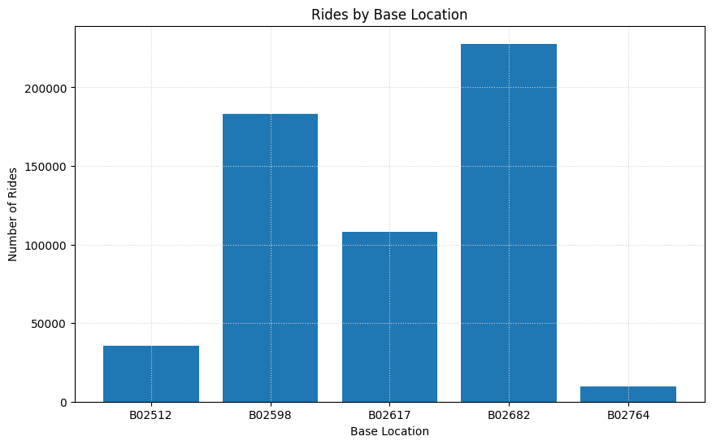
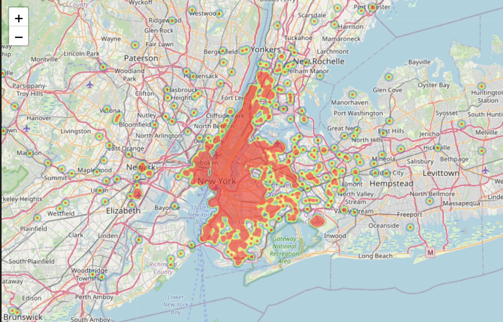

# UberRideInsights
A Git repository for analyzing and exploring Uber ride data, providing insights into patterns, trends, and performance metrics for informed decision-making and optimization.

### Data description
The dataset contains information about the Datetime, Latitude, Longitude and Base of each uber ride that happened in the month of April 2014 to Sep 2014 at New York City, USA. The dataset is obtained from Kaggle.

Kaggle dataset link: https://www.kaggle.com/datasets/fivethirtyeight/uber-pickups-in-new-york-city?select=uber-raw-data-jul14.csv

`Features in the data set`

`Date/Time` : The date and time of the Uber pickup

`Lat` : The latitude of the Uber pickup

`Lon` : The longitude of the Uber pickup

`Base` : The TLC base company code affiliated with the Uber pickup

The Base codes are for the following Uber bases:

B02512 : Unter

B02598 : Hinter

B02617 : Weiter

B02682 : Schmecken

B02764 : Danach-NY

### Project Description
Analyzing Uber ride data provides valuable insights to:

1. Optimize operations, reduce wait times, and meet peak demand efficiently.
2. Enhance customer experience, minimize wait times, and improve service quality.
3. Implement effective pricing strategies and maximize revenue potential.
4. Personalize promotions, loyalty programs, and targeted marketing campaigns.
5. Identify high-demand areas for expansion, resource allocation, and new driver hubs.
6. Forecast ride demand for proactive planning and resource management.
7. Evaluate performance metrics to ensure quality services and identify areas for improvement.

By leveraging data analysis, Uber can make informed decisions, improve operations, and deliver exceptional customer experiences in the competitive ride-hailing industry.

### Notebook

Please refer to the [EDA-uberdata.ipynb](EDA-uberdata.ipynb) notebook for detailed analysis and code scripts.

### Analysis Figures

### Figure 1: Rides by Days

*Figure 1: Distribution of rides over days of the month.*

### Figure 2: Rides by Hour

*Figure 2: Distribution of rides over hours of the day.*

### Figure 3: Average Rides per Day per Hour

*Figure 3: Average number of rides per day per hour.*

### Figure 4: Rides Heatmap by Hour

*Figure 4: Heatmap showing the density of rides at different hours of the day.*

### Figure 5: Rides by Base Location

*Figure 5: Distribution of rides across different base locations.*

### Dynamic Heat Map

To view the interactive dynamic heat map, please open the [heatmap.html](heatmap.html) file in your browser. The toggle bar can be slided to see the change in pickup locations with respect to each hour.

### `Insights`

- The average number of rides in April is approximately 19,000.

    - Weekdays exhibit consistent booking patterns, while weekends, especially Sundays, have lower demand.

- Peak ride hours are observed during morning (7-9 am) and evening (5-7 pm) commute times.

    - Optimizing driver management can reduce waiting times and enhance customer satisfaction.

- The average rides per day per hour plot reveals weekday peaks during office hours and additional peaks on Friday and Saturday evenings.

    - Social outings contribute to higher demand during weekend evenings.

- Base location codes, such as B02598 and B02682, have the highest number of bookings.

    - Efficient driver allocation and demand analysis can be achieved using these codes.

- The scatter plot of latitude and longitude depicts pickup locations, with the dark blue central area indicating high-demand regions.

    - Overlaying the plot on a geographical map can provide contextual understanding.

- The dynamic heat map helps identify hotspots and high-density pickup areas.

    - It assists in optimizing resource allocation and understanding customer preferences.

By analyzing these insights, businesses can enhance their operations, improve customer experiences, and make data-driven decisions for better performance.

### Acknowledgments

- The dataset is taken from the Kaggle platform that inspired this analysis.
